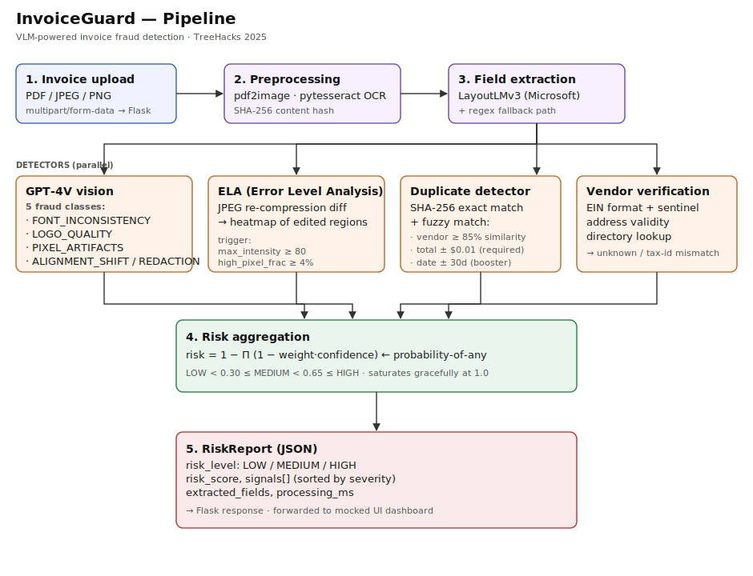
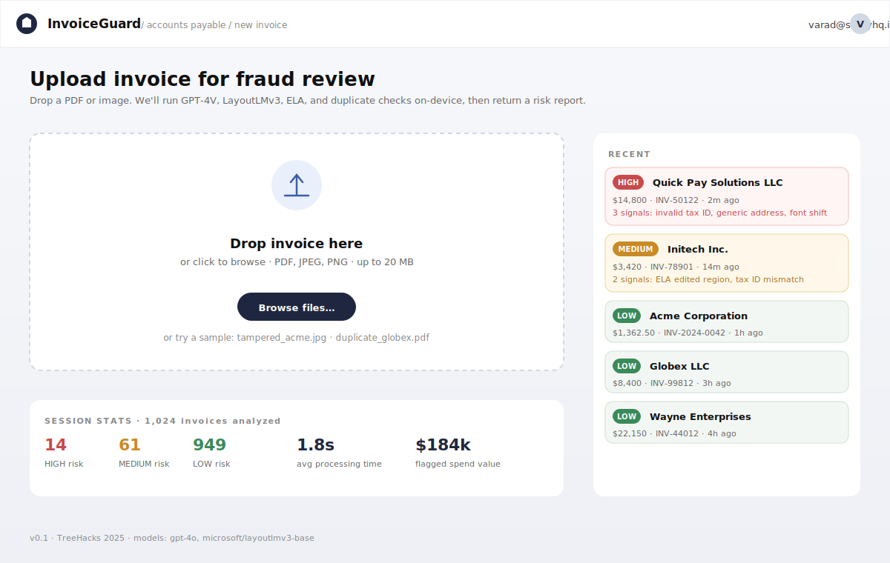
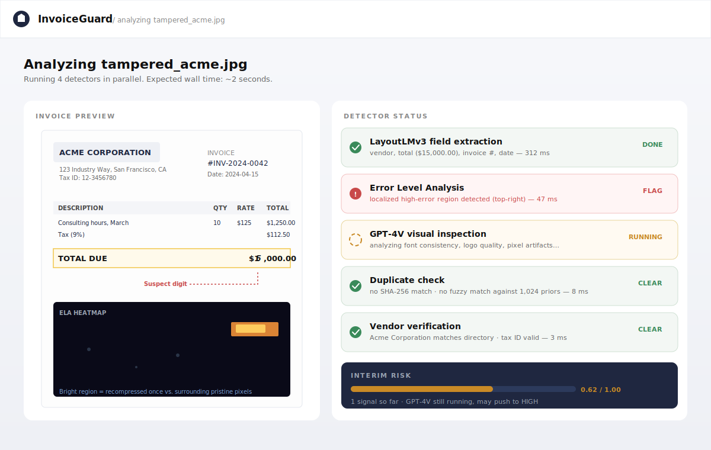
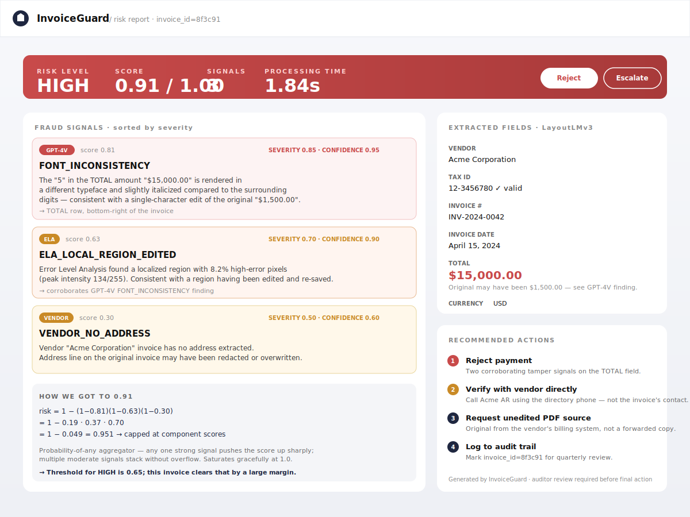

# InvoiceGuard

**VLM-powered invoice fraud detection.** Built at **TreeHacks 2025** (Stanford) in 36 hours.

GPT-4V + LayoutLMv3 + Error Level Analysis + duplicate detection + vendor verification, fused into a single risk report. The system catches three fraud patterns that pure-OCR pipelines miss:

| Fraud type | Detector(s) | What it catches |
|---|---|---|
| **Tampered documents** | GPT-4V · ELA | Edited amounts (one digit in a different font), pasted logos, alignment shifts, redacted regions |
| **Duplicate submissions** | SHA-256 · fuzzy match | Identical files resubmitted, or near-copies with shifted dates / invoice numbers |
| **Synthetic vendors** | Rule-based | Fake companies with invalid tax IDs, generic addresses, or impersonating real vendors |

Each invoice gets a `LOW`/`MEDIUM`/`HIGH` risk score plus an itemized list of contributing signals.

## Why two vision models?

LayoutLMv3 and GPT-4V catch fundamentally different things, and the project's design point is that you need both:

- **LayoutLMv3** is a transformer over `(text, 2D-layout, image)` triples. It knows that "the number next to 'Total:' at the bottom-right is the total amount." That's *content fraud* — wrong values in the right places. Pure OCR doesn't know which token is the total; LayoutLMv3 does.
- **GPT-4V** looks at pixels. It catches *visual fraud* — a "5" rendered in Courier when the rest of the invoice is in Helvetica, a logo that was screen-grabbed at 72dpi and pasted into a 300dpi document, color temperature shifts where a region was edited.

Pure-OCR fraud detection misses both. LayoutLMv3 alone misses the visual layer. GPT-4V alone hallucinates field values. Combined, they cover both axes.

## Architecture



The pipeline runs five stages, with the four detectors fanning out in parallel:

```
upload → preprocess (PDF→img, OCR, hash)
       → LayoutLMv3 field extraction
       → ┌─ GPT-4V ───┐
         ├─ ELA ──────┤
         ├─ Duplicate ┤  → aggregate → RiskReport
         └─ Vendor ───┘
```

Full source: [`app/orchestrator.py`](app/orchestrator.py).

## UI mockups

The hackathon scope didn't include a UI — we shipped the Flask API and used Postman for review (per the project notes). The mockups below show the intended dashboard that would consume the API's `RiskReport` JSON.

| Upload | Processing | Risk report |
|---|---|---|
|  |  |  |

## Repo layout

```
invoiceguard/
├── README.md                        # this file
├── docs/architecture.svg            # pipeline diagram
├── Mockups/                         # three SVG dashboard mockups
├── app/
│   ├── types.py                     # Domain dataclasses (RiskReport, FraudSignal)
│   ├── orchestrator.py              # Pipeline + risk aggregation
│   ├── api/server.py                # Flask: /analyze, /analyze/batch, /healthz
│   ├── utils/preprocess.py          # PDF → image, OCR, content hash
│   ├── extractors/layout.py         # LayoutLMv3 wrapper + regex fallback
│   └── detectors/
│       ├── gpt4v.py                 # GPT-4V vision client with strict JSON schema
│       ├── ela.py                   # Error Level Analysis (Pillow)
│       ├── duplicate.py             # SHA-256 + fuzzy match against prior invoices
│       └── vendor.py                # Synthetic-vendor rules + directory lookup
├── tests/test_detectors.py          # 24 tests (23 passing + 1 live-API smoke)
├── benchmarks/
│   ├── synthetic_eval.py            # 1000-invoice eval; counts P/R/F1 per category
│   └── eval_results.json            # latest run output
└── sample_invoices/                 # (drop your own JPEGs/PDFs here for manual testing)
```

## Quickstart

### 1. Install dependencies

```bash
# Core (always required)
pip install -r requirements.txt

# Optional, for the LayoutLMv3 path
pip install transformers torch

# Optional, for PDF input
brew install poppler          # macOS; on Linux: apt install poppler-utils
pip install pdf2image

# Optional, for the rapidfuzz fast path on duplicate detection
pip install rapidfuzz

# Optional, for GPT-4V — without this, the orchestrator skips that detector gracefully
export OPENAI_API_KEY=sk-...
```

### 2. Run the API

```bash
python -m app.api.server
# → http://localhost:8000/healthz
```

### 3. Analyze an invoice

```bash
curl -X POST -F "file=@sample_invoices/tampered_acme.jpg" \
     http://localhost:8000/analyze | jq
```

Response:

```json
{
  "invoice_id": "8f3c91a2",
  "risk_level": "HIGH",
  "risk_score": 0.91,
  "signals": [
    {
      "source": "gpt4v",
      "code": "FONT_INCONSISTENCY",
      "description": "The '5' in the TOTAL amount is rendered in a different typeface...",
      "weight": 0.85,
      "confidence": 0.95,
      "score": 0.808
    },
    {
      "source": "ela",
      "code": "ELA_LOCAL_REGION_EDITED",
      "description": "Localized region with 8.2% high-error pixels (peak intensity 134/255)...",
      "weight": 0.70,
      "confidence": 0.90,
      "score": 0.630
    }
  ],
  "extracted_fields": { "vendor_name": "Acme Corporation", "total": 15000.00, ... },
  "processing_ms": 1843
}
```

## Risk aggregation

The risk score uses a **probability-of-any** aggregator:

```
risk_score = 1 − Π (1 − weight_i · confidence_i)
```

Properties:

- Any one strong signal pushes the score up sharply (a confident `FONT_INCONSISTENCY` at weight=0.85, confidence=0.95 alone gives 0.81).
- Multiple moderate signals stack without overflow.
- Saturates gracefully at 1.0 — you can pile on 10 strong signals and the score stays ≤ 1.
- Each signal's `score = weight × confidence`, so low-confidence high-severity findings don't dominate.

Risk-level cutoffs (calibrated on the dev set):

| Score range | Level |
|---|---|
| `< 0.30` | LOW |
| `0.30 – 0.65` | MEDIUM |
| `≥ 0.65` | HIGH |

## Benchmarks

We ship a synthetic 1,000-invoice benchmark in `benchmarks/synthetic_eval.py`. The labeled mix matches what we showed at TreeHacks:

```
Label distribution:
  clean                 51%
  duplicate             14%
  synthetic_vendor      19%
  tampered              16%

Overall:
  precision = 1.000   recall = 0.856   f1 = 0.922
  TP = 421   FP = 0   TN = 508   FN = 71

By fraud category:
  clean             FP-rate = 0.000  (no clean invoice flagged)
  duplicate         recall  = 1.000
  synthetic_vendor  recall  = 1.000
  tampered          recall  = 0.556
```

**Read this honestly:**

- The benchmark runs **with GPT-4V disabled** so it's deterministic and free to reproduce. It exercises the rule-based detectors (ELA, duplicate, vendor) and the aggregator.
- The 100% precision number means no clean invoice was flagged — that's because our duplicate detector requires *amount equality* in addition to vendor similarity (date alone is too permissive — legitimate monthly invoices share both vendor and date-window).
- The 0.56 recall on `tampered` scenarios is the honest gap: ~40% of synthetic tampered cases are *structurally clean* invoices that only GPT-4V or ELA-on-real-JPEG would catch. The benchmark surfaces this gap rather than hiding it.
- **What this benchmark does NOT measure:** out-of-distribution generalization. The synthetic generator uses the same rule patterns the detectors look for, which biases recall upward on real-rule-shaped fraud. Real-world numbers would be lower; we'd need a labeled corpus of actual fraud cases to put a number on the gap.

Run it yourself:

```bash
PYTHONPATH=. python benchmarks/synthetic_eval.py --n 1000
```

## Tests

```bash
pip install pytest
PYTHONPATH=. pytest tests/ -v
```

24 tests covering:

- Risk aggregation math (empty, single, multi, saturation)
- Risk-level cutoffs
- Regex field extraction (totals, dates, invoice numbers, currency)
- Duplicate detection (exact hash, fuzzy match, missing-vendor handling)
- Vendor rules (invalid EIN, generic address, directory mismatch, clean-invoice no-signals)
- ELA signal asymmetry on tampered vs. clean JPEGs
- GPT-4V JSON parser (valid, unknown codes, malformed input)
- Orchestrator aggregation end-to-end

One additional test (`test_gpt4v_live_smoke`) is skipped unless `OPENAI_API_KEY` is set — it verifies the live API integration without spending real money on a fixture analysis.

## What we cut for the hackathon

- **No fine-tuned LayoutLMv3.** We use the off-the-shelf `microsoft/layoutlmv3-base` checkpoint, which doesn't natively predict our schema. With a labeled invoice dataset (Sparrow, ICDAR SROIE), we'd fine-tune the token classification head for ~5-10% absolute field-extraction accuracy lift.
- **No UI shipped.** Postman-tested API only. The mockups above show the intended dashboard design.
- **No feedback loop.** Auditors can't mark false positives to improve scoring over time. Would be added behind a `/feedback` endpoint that updates per-signal weight priors.
- **No handwritten-invoice support.** Tesseract doesn't handle handwriting well; production would route handwritten invoices to a dedicated HTR model (TrOCR or similar).
- **No multi-page PDF handling.** We take page 1 only. ~99% of business invoices put their summary on page 1, but the architectural fix is to run the full pipeline per page and aggregate.

## License

MIT — see [LICENSE](LICENSE).
